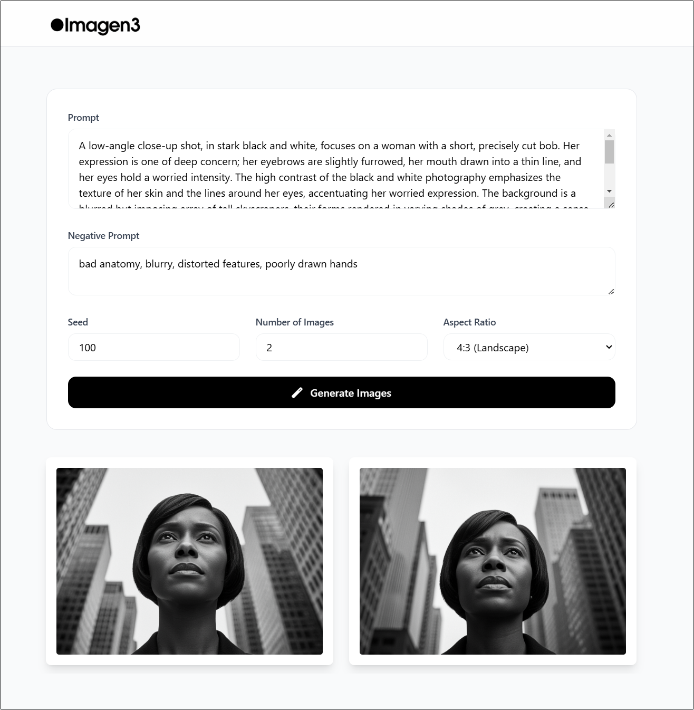

# Imagen3 WebApp

A powerful web application leveraging Google's Imagen 3.0 model to generate high-quality images with enhanced detail, richer lighting, and fewer artifacts. This application provides an intuitive interface for AI image generation with advanced customization options.

<div align="center">
  
</div>

## ✨ Features

- 🎨 Advanced image generation using Imagen 3.0
- 🎯 Customizable negative prompts
- 🔄 Adjustable seed values for reproducible results
- 📐 Multiple aspect ratio options (1:1, 3:4, 4:3, 16:9, 9:16)
- 🖼️ Generate multiple images in one request
- 💻 Modern, responsive UI with glass morphism design
- 🔍 Image preview with zoom functionality
- ⬇️ Direct image download capability

## 🚀 Demo Result

<div align="center">
  
</div>

The following image was generated using this prompt:

> A low-angle close-up shot, in stark black and white, focuses on a woman with a short, precisely cut bob. Her expression is one of deep concern; her eyebrows are slightly furrowed, her mouth drawn into a thin line, and her eyes hold a worried intensity. The high contrast of the black and white photography emphasizes the texture of her skin and the lines around her eyes, accentuating her worried expression. The background is a blurred but imposing array of tall skyscrapers, their forms rendered in varying shades of grey, creating a sense of depth and scale.

## 🛠️ Technology Stack

- **Frontend**: HTML, TailwindCSS, JavaScript
- **Backend**: Python, Flask
- **AI Model**: Google Vertex AI (Imagen 3.0)
- **UI Components**: Font Awesome, Custom CSS animations

## ⚙️ Installation

1. Clone the repository:
```bash
git clone https://github.com/shivsinghin/Imagen3-Webapp.git
cd imagen3-webapp
```

3. Set up your Google Cloud Project:
   - Create a project in Google Cloud Console
   - Enable Vertex AI API
   - Set up authentication
   - Update `PROJECT_ID` in `app.py`

4. Run the application:

 ```bash
python app.py
```

## 🔑 Environment Variables

Create a `.env` file in the root directory and add:

env
PROJECT_ID=your-googlecloud-project-id-here


## 🌟 Usage

1. Access the web interface at `http://localhost:5000`
2. Enter your desired image prompt
3. Customize generation parameters:
   - Adjust negative prompts
   - Set seed value
   - Choose number of images
   - Select aspect ratio
4. Click "Generate Images"
5. View, zoom, or download generated images

## 🤝 Contributing

Contributions are welcome! Please feel free to submit a Pull Request.

1. Fork the repository
2. Create your feature branch (`git checkout -b feature/AmazingFeature`)
3. Commit your changes (`git commit -m 'Add some AmazingFeature'`)
4. Push to the branch (`git push origin feature/AmazingFeature`)
5. Open a Pull Request

## 📝 License

This project is licensed under the MIT License - see the [LICENSE](LICENSE) file for details.

## 📬 Contact

* Website: [shivsingh.com](https://shivsingh.com)
* Email: hi@shivsingh.com
* LinkedIn: [Shiv Singh](https://linkedin.com/in/shivsinghin)
